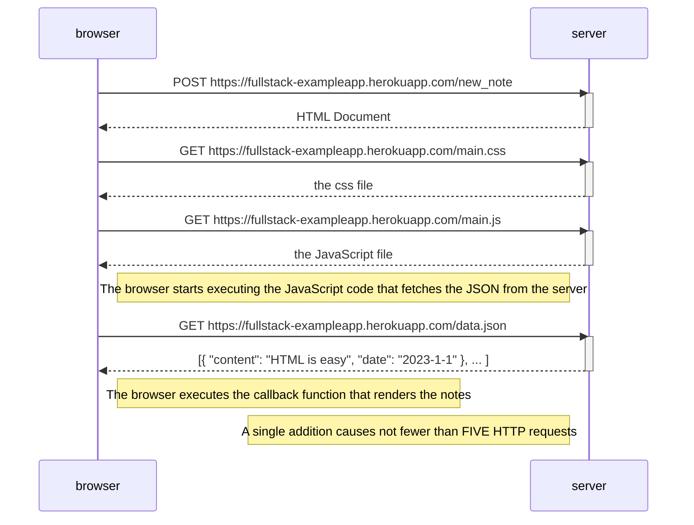

```mermaid
sequenceDiagram
    participant browser
    participant server

    browser->>server: POST https://fullstack-exampleapp.herokuapp.com/new_note
    activate server
    %% activate appends the changes in the notes html file
    
    server-->>browser: HTML Document
    deactivate server

    browser->>server: GET https://fullstack-exampleapp.herokuapp.com/main.css
    activate server
    server-->>browser: the css file
    deactivate server

    browser->>server: GET https://fullstack-exampleapp.herokuapp.com/main.js
    activate server
    server-->>browser: the JavaScript file
    deactivate server

    Note right of browser: The browser starts executing the JavaScript code that fetches the JSON from the server

    browser->>server: GET https://fullstack-exampleapp.herokuapp.com/data.json
    activate server
    server-->>browser: [{ "content": "HTML is easy", "date": "2023-1-1" }, ... ]
    deactivate server

    Note right of browser: The browser executes the callback function that renders the notes
    Note left of server: A single addition causes not fewer than FIVE HTTP requests
```